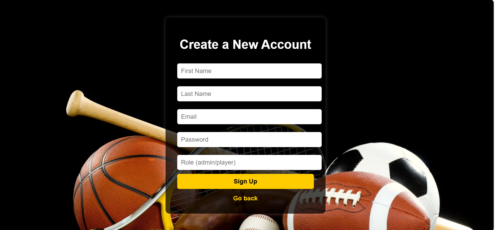
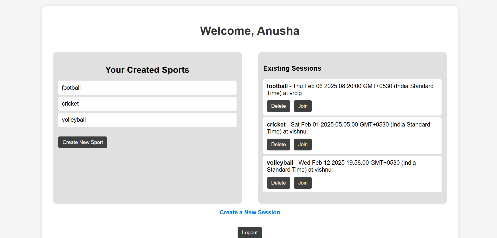
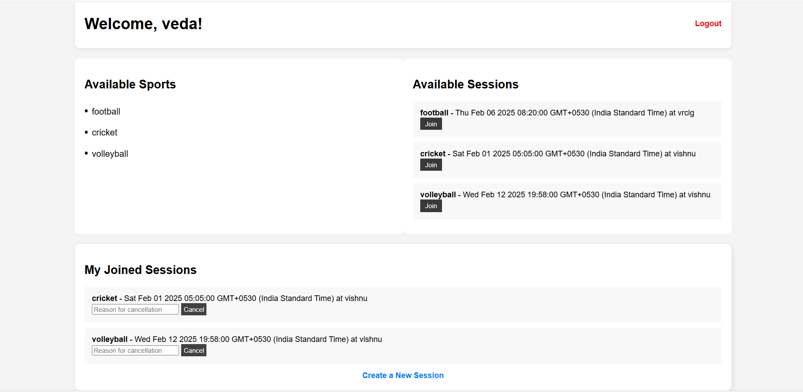
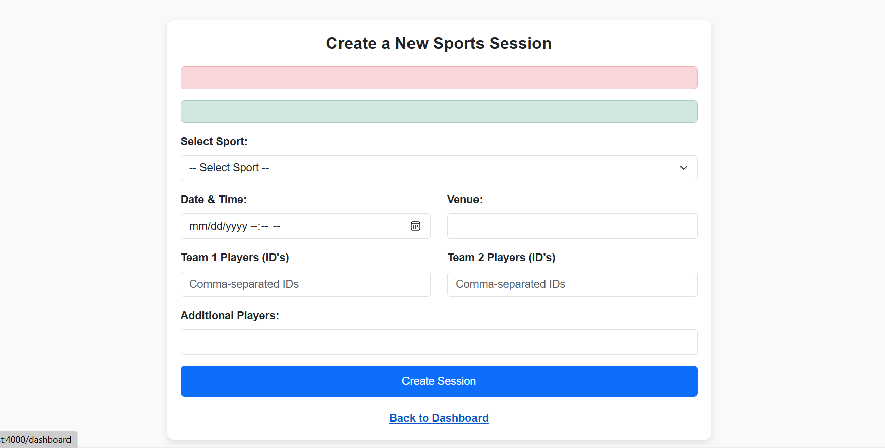

# Sports Scheduler Web Application

## 📌 Overview
The **Sports Scheduler** web application is designed to help users organize and join sports sessions seamlessly. It allows players and admins to manage sessions, track participation, and ensure smooth scheduling of various sports activities.

## 🚀 Features

### 🔹 User Authentication & Authorization
- Players and admins can sign up, sign in, and sign out.
- Secure authentication using bcrypt for password hashing.
- Passport.js is used for session management and login authentication.

### 🔹Role-Based Access
- Admins can create, edit, and manage available sports.
- Players can create sports sessions, join existing sessions, and cancel their participation.
- Admins have access to reports of sessions played and the popularity of different sports.

### 🔹 Session Management
- Admins can create and manage sports sessions.
- Players can join available sessions.
- Players can cancel their participation by providing a reason.

### 🔹 Sports Management
- Admins can add different sports (e.g., football, cricket, volleyball).
- Sessions are categorized based on sports type.

### 🔹 Team Allocation
- Players are automatically assigned to Team 1 or Team 2 based on availability.
- Prevents duplicate participation in a single session.

### 🔹 Flash Messages
- Success and error messages displayed after actions like joining or canceling sessions.

### 🔹 CSRF Protection
- Secure form submissions with CSRF tokens.

### 🔹 Database Management
- PostgreSQL database managed using Sequelize ORM.
- Tables implemented:
- sports (stores sports names).
- user (stores admin and player credentials).
-sessions (stores session details, teams, and players)

### Here are some screenshots of the sports scheduler i have created

### **1. Sign In Page**  
  

### **2. Sign Up Page**  
  

### **3. Admin Dashboard**  
  

### **4. Player Dashboard**  
  

### **5. Session Management**  
  

### **6. Main Dashboard View**  
 

## 🛠️ Technologies Used
- **Frontend:** HTML, CSS, EJS
- **Backend:** Node.js, Express.js
- **Database:** PostgreSQL (Sequelize ORM)
- **Authentication:** Passport.js
- **Session Management:** Express-session, Connect-flash
- **Security:** CSRF Protection, bcrypt for password hashing

